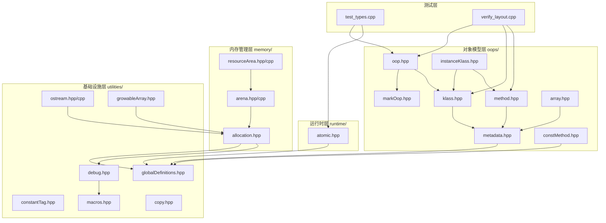
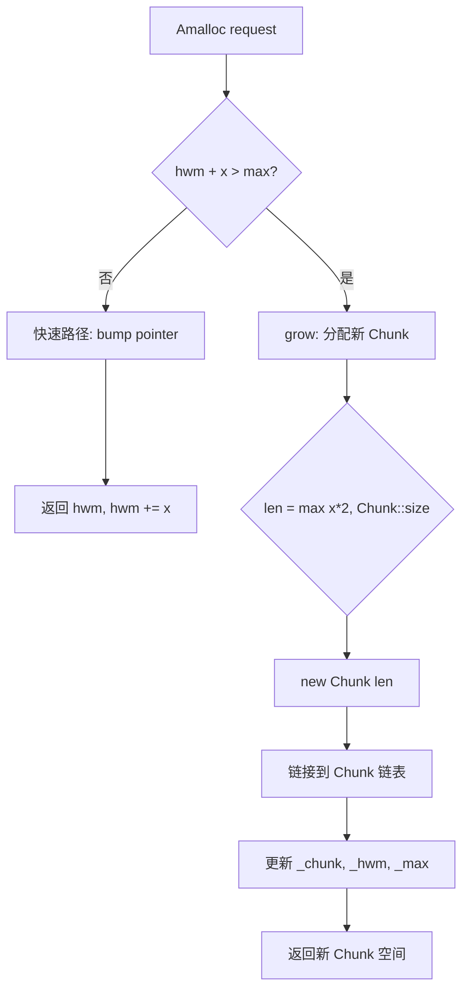
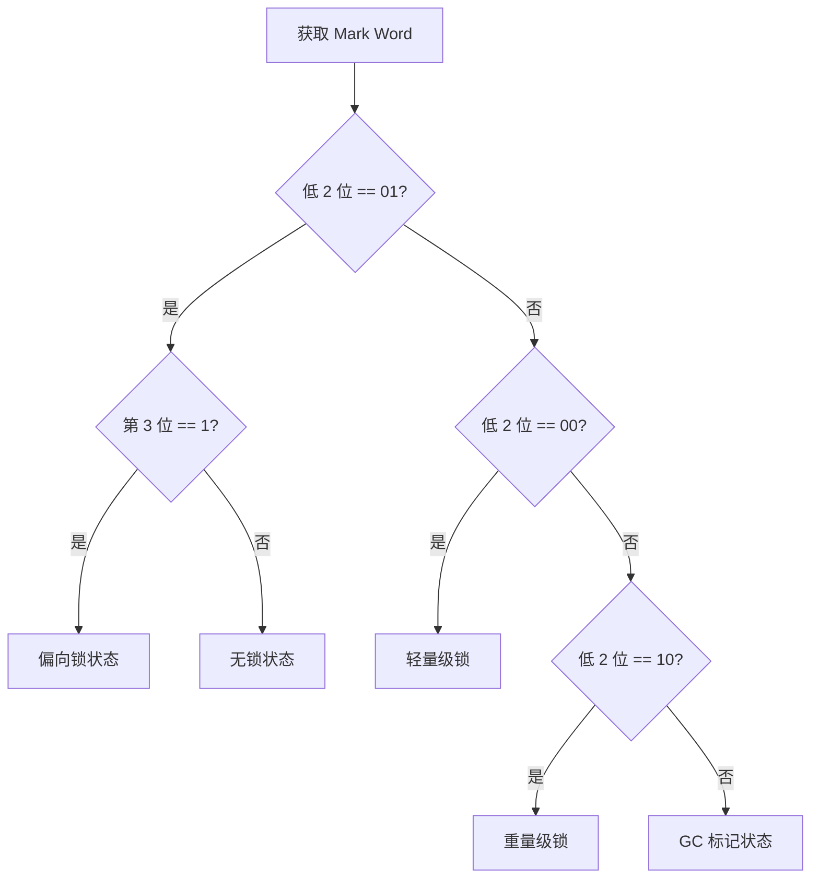
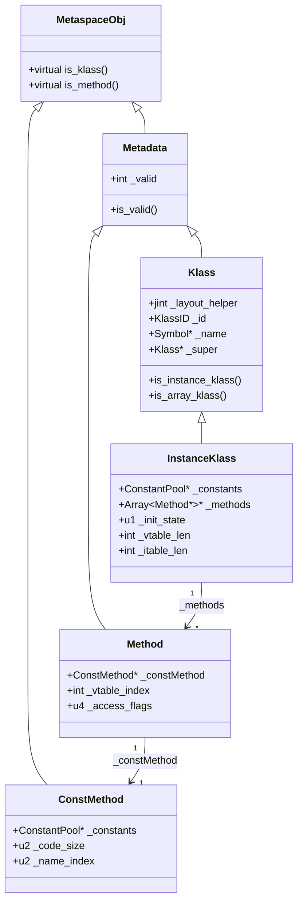
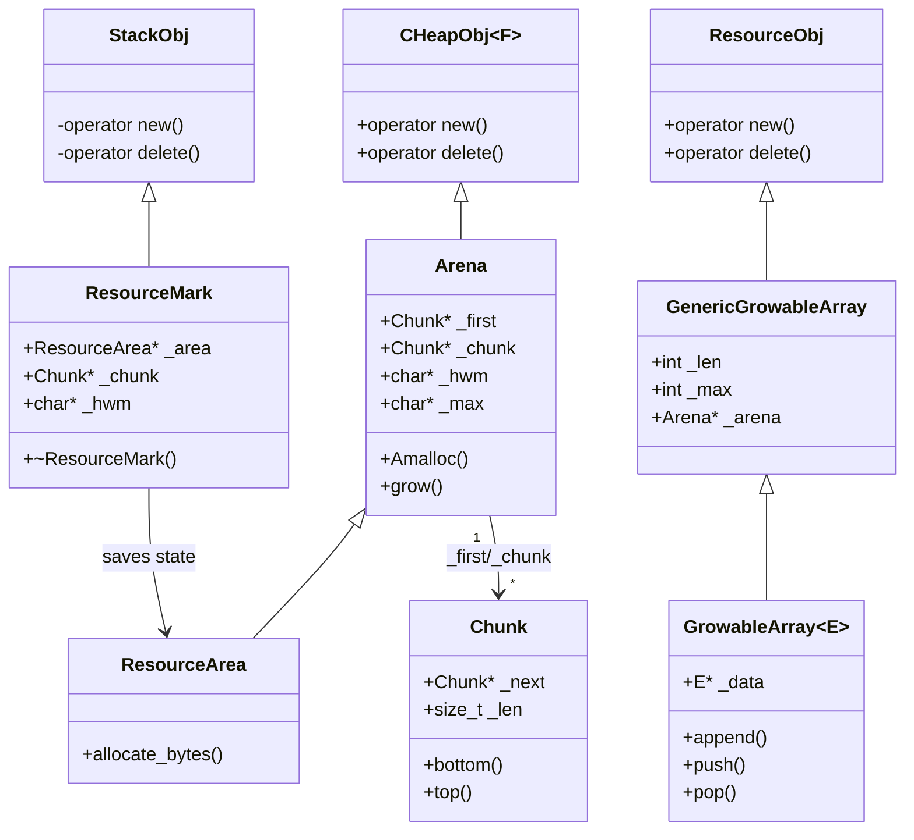

# my_jvm v1.0 第一版代码完整解析

> 基于 OpenJDK 11 源码深度分析，还原 JVM 核心数据结构
> 方法论：程序 = 数据结构 + 算法

---

## 第 0 部分：项目概览

### 0.1 项目定位

**my_jvm** 是一个教学性质的 JVM 实现项目，目标不是"能跑就行"，而是**每个核心机制都按照 OpenJDK 11 的真实设计实现**：

- 数据结构与 OpenJDK 11 对齐（字段含义、内存布局、生命周期）
- 算法与 OpenJDK 11 对齐（核心路径、状态机、关键设计决策）

### 0.2 第一版代码范围

第一版代码覆盖了 JVM 的**基础设施层**：

```
┌─────────────────────────────────────────────────────────────────┐
│                        my_jvm v1.0 架构                          │
├─────────────────────────────────────────────────────────────────┤
│                                                                 │
│   ┌─────────────┐                                               │
│   │   test/     │  ← 测试验证层                                 │
│   └──────┬──────┘                                               │
│          │                                                      │
│   ┌──────▼──────┐                                               │
│   │    oops/    │  ← 对象模型层 (oop/Klass/Method)              │
│   └──────┬──────┘                                               │
│          │                                                      │
│   ┌──────▼──────┐                                               │
│   │   memory/   │  ← 内存管理层 (Arena/ResourceArea)            │
│   └──────┬──────┘                                               │
│          │                                                      │
│   ┌──────▼──────┐                                               │
│   │ utilities/  │  ← 基础设施层 (类型/断言/输出)                 │
│   └─────────────┘                                               │
│                                                                 │
└─────────────────────────────────────────────────────────────────┘
```

### 0.3 文件清单与依赖关系



---

## 第 1 部分：数据结构全景

### 1.1 数据结构清单

| 结构名 | 文件位置 | 核心作用 | 对标 OpenJDK |
|--------|----------|----------|--------------|
| `oopDesc` | oops/oop.hpp | Java 堆对象的基类 | oop.hpp |
| `markOopDesc` | oops/markOop.hpp | 对象头 Mark Word 编码 | markOop.hpp |
| `Metadata` | oops/metadata.hpp | 元数据基类（Metaspace 中） | metadata.hpp |
| `Klass` | oops/klass.hpp | 类元数据基类 | klass.hpp |
| `InstanceKlass` | oops/instanceKlass.hpp | 普通 Java 类元数据 | instanceKlass.hpp |
| `Method` | oops/method.hpp | 方法元数据 | method.hpp |
| `ConstMethod` | oops/constMethod.hpp | 方法只读数据 | constMethod.hpp |
| `Array<T>` | oops/array.hpp | 元数据数组模板 | array.hpp |
| `Chunk` | memory/arena.hpp | Arena 内存块 | arena.hpp |
| `Arena` | memory/arena.hpp | 快速内存分配区 | arena.hpp |
| `ResourceArea` | memory/resourceArea.hpp | 资源区（栈式内存） | resourceArea.hpp |
| `ResourceMark` | memory/resourceArea.hpp | 资源区状态保存/恢复 | resourceArea.hpp |
| `outputStream` | utilities/ostream.hpp | 输出流基类 | ostream.hpp |
| `GrowableArray<T>` | utilities/growableArray.hpp | 可扩容数组 | growableArray.hpp |
| `constantTag` | utilities/constantTag.hpp | 常量池标签 | constantTag.hpp |

---

### 1.2 oopDesc 详细分析

#### 1.2.1 字段列表

```cpp
// oop.hpp
class oopDesc {
private:
    volatile markOop _mark;        // 对象头：锁状态、哈希码、GC 信息
    
    union _metadata {
        Klass*      _klass;              // 64位：直接 Klass 指针
        narrowKlass _compressed_klass;   // 64位：压缩 Klass 指针（32位）
    } _metadata;                         // 元数据指针
};
```

#### 1.2.2 字段含义

| 字段 | 类型 | 大小 | 含义 |
|------|------|------|------|
| `_mark` | `volatile markOop` | 8 bytes | Mark Word：存储锁状态、哈希码、GC 年龄、偏向锁线程 ID |
| `_metadata._klass` | `Klass*` | 8 bytes | 指向 Metaspace 中的类元数据 |
| `_metadata._compressed_klass` | `narrowKlass` | 4 bytes | 压缩 Klass 指针（启用 CompressedClassPointers 时） |

#### 1.2.3 sizeof 与内存布局

```
64-bit 模式（无压缩指针）：
┌───────────────────────────────────────────────────────────┐
│ offset 0-7:   _mark (markOop = markOopDesc*)              │
├───────────────────────────────────────────────────────────┤
│ offset 8-15:  _metadata (Klass* 或 narrowKlass + padding) │
└───────────────────────────────────────────────────────────┘
sizeof(oopDesc) = 16 bytes
```

#### 1.2.4 设计决策

**为什么 `_mark` 是 `volatile`？**
- 多线程并发访问：锁竞争时多个线程会同时修改 Mark Word
- GC 并发标记：GC 线程会修改对象头的标记位
- 必须保证可见性，防止编译器优化导致的数据不一致

**为什么使用 union 存储 Klass 指针？**
- 支持两种模式切换：普通指针 vs 压缩指针
- 压缩指针节省内存：32 位 Klass 指针可寻址 4GB Metaspace
- 运行时根据 `-XX:+UseCompressedClassPointers` 决定使用哪个成员

---

### 1.3 markOopDesc 详细分析

#### 1.3.1 字段列表

```cpp
// markOop.hpp
class markOopDesc {
    // 无数据成员！this 指针本身就是值
    uintptr_t value() const { return (uintptr_t)this; }
};
```

#### 1.3.2 锁状态编码（位域布局）

Mark Word 是 JVM 中最精妙的设计之一，在 64 位模式下有 5 种状态：

```
64-bit Mark Word 布局（OpenJDK 11）:

┌───────────────────────────────────────────────────────────────────┐
│ 状态            │ 位域布局（64 bits）                               │
├───────────────────────────────────────────────────────────────────┤
│ 无锁 (unlocked) │ unused:25│hashcode:31│unused:1│age:4│bias:1│01  │
│ 偏向锁 (biased) │ thread:54│epoch:2    │unused:1│age:4│bias:1│01  │
│ 轻量锁 (light)  │ ptr_to_lock_record:62                              │00  │
│ 重量锁 (heavy)  │ ptr_to_object_monitor:62                           │10  │
│ GC 标记         │ ptr_to_marking_info:62                             │11  │
└───────────────────────────────────────────────────────────────────┘
                                                                   ↑
                                                              lock bits
```

#### 1.3.3 锁状态判断函数源码

```cpp
// markOop.hpp
bool is_unlocked() const {
    return (value() & 0x7) == unlocked_value;  // 末尾 3 位 == 001
}

bool is_locked() const {
    return (value() & 0x3) != unlocked_value;  // 末尾 2 位 != 01
}

bool is_marked() const {
    return (value() & 0x3) == marked_value;    // 末尾 2 位 == 11
}
```

#### 1.3.4 锁状态构造函数

```cpp
// 无锁状态
inline markOop markWord_unlocked() {
    return (markOop)(uintptr_t)markOopDesc::unlocked_value;  // = 1
}

// 轻量级锁：直接存储 Lock Record 指针，末尾 2 位为 00
inline markOop markWord_lightweight_locked(void* lock_rec) {
    return (markOop)((uintptr_t)lock_rec);  // 指针本身末尾是 00
}

// 重量级锁：存储 ObjectMonitor 指针，末尾 2 位为 10
inline markOop markWord_heavyweight_locked(void* monitor) {
    return (markOop)((uintptr_t)monitor | 0x2);
}

// 偏向锁：线程 ID + epoch + age + bias 标志
inline markOop markWord_biased(void* thread, int age, int epoch) {
    uintptr_t ptr = (uintptr_t)thread;
    ptr |= ((uintptr_t)epoch << 8) | ((uintptr_t)age << 3) | 0x5;
    return (markOop)ptr;
}
```

#### 1.3.5 设计决策

**为什么末尾 2 位用作锁标志？**
- 指针对齐：所有对象/结构体都对齐到 4/8 字节边界，末尾 2-3 位总是 0
- 零成本编码：无需额外存储空间，复用指针的无效位

**为什么偏向锁和偏向锁共享 01 标志？**
- 用第 3 位（bias bit）区分：bias=1 是偏向锁，bias=0 是无锁
- 历史原因：偏向锁是后来添加的优化，要兼容无锁状态

---

### 1.4 Klass 详细分析

#### 1.4.1 字段列表

```cpp
// klass.hpp
class Klass : public Metadata {
protected:
    jint        _layout_helper;              // 对象布局辅助
    const KlassID _id;                       // Klass 类型 ID
    
    juint       _super_check_offset;         // 子类型检查偏移
    Symbol*     _name;                       // 类名
    
    Klass*      _secondary_super_cache;      // 次级超类缓存
    Array<Klass*>* _secondary_supers;        // 次级超类数组
    Klass*      _primary_supers[8];          // 主超类数组（快速路径）
    
    OopHandle   _java_mirror;                // java.lang.Class 对象
    Klass*      _super;                      // 父类
    Klass*      _subklass;                   // 第一个子类
    Klass*      _next_sibling;               // 兄弟节点
    Klass*      _next_link;                  // 同一 ClassLoader 的链表
    
    ClassLoaderData* _class_loader_data;     // 类加载器数据
    
    jint        _modifier_flags;             // 修饰符
    juint       _access_flags;               // 访问标志
    
    uint64_t    _jfr_trace_id;               // JFR 追踪 ID
    jlong       _last_biased_lock_bulk_revocation_time;
    markOop     _prototype_header;           // 偏向锁原型头
    jint        _biased_lock_revocation_count;
    int         _vtable_len;                 // vtable 长度
    
    jshort      _shared_class_path_index;
    u2          _shared_class_flags;
};
```

#### 1.4.2 sizeof 与内存布局

```
64-bit slowdebug 模式：
sizeof(Klass) = 208 bytes

┌─────────────────────────────────────────────────────────────────┐
│ [0-15]    Metadata 基类 (vtable + _valid + padding)             │
├─────────────────────────────────────────────────────────────────┤
│ [16-19]   _layout_helper                                        │
│ [20-23]   _id                                                   │
│ [24-27]   _super_check_offset                                   │
│ [28-31]   padding                                               │
│ [32-39]   _name                                                 │
│ [40-47]   _secondary_super_cache                                │
│ [48-55]   _secondary_supers                                     │
│ [56-119]  _primary_supers[8]                                    │
│ [120-127] _super                                                │
│ [128-135] _java_mirror                                          │
│ [136-143] _subklass                                             │
│ [144-151] _next_sibling                                         │
│ [152-159] _next_link                                            │
│ [160-167] _class_loader_data                                    │
│ [168-171] _modifier_flags                                       │
│ [172-175] _access_flags（含 padding）                           │
│ ...                                                             │
│ [196-199] _vtable_len                                           │
│ ...                                                             │
└─────────────────────────────────────────────────────────────────┘
```

#### 1.4.3 关键字段生命周期

**`_layout_helper`**
- 设置时机：类加载时（`ClassFileParser::layout_helper`）
- 设置者：`Klass::set_layout_helper()`
- 含义：
  - 实例类：正数 = 实例大小（字节）
  - 数组类：负数，编码了数组元素信息
  - 接口/抽象类：0

**`_primary_supers[8]`**
- 设置时机：类加载链接阶段
- 设置者：`Klass::initialize_supers()`
- 作用：快速子类型检查（直接索引，O(1)）
- 内容：Object、父类、祖父类...最多 8 层

---

### 1.5 InstanceKlass 详细分析

#### 1.5.1 字段列表

```cpp
// instanceKlass.hpp
class InstanceKlass : public Klass {
protected:
    Annotations*    _annotations;           // 注解
    PackageEntry*   _package_entry;         // 包信息
    Klass* volatile _array_klasses;         // 数组类
    ConstantPool*   _constants;             // 常量池
    
    Array<u2>*      _inner_classes;         // 内部类
    Array<u2>*      _nest_members;          // Nest 成员
    u2              _nest_host_index;       // Nest 宿主索引
    InstanceKlass*  _nest_host;             // Nest 宿主
    
    const char*     _source_debug_extension;
    void*           _array_name;
    
    int             _nonstatic_field_size;  // 非静态字段大小
    int             _static_field_size;     // 静态字段大小
    
    u2              _generic_signature_index;
    u2              _source_file_name_index;
    u2              _static_oop_field_count;
    u2              _java_fields_count;
    
    int             _nonstatic_oop_map_size;
    int             _itable_len;            // itable 长度
    
    bool            _is_marked_dependent;
    bool            _is_being_redefined;
    u2              _misc_flags;
    
    u2              _minor_version;         // 类文件版本
    u2              _major_version;
    
    Thread*         _init_thread;           // 初始化线程
    OopMapCache* volatile _oop_map_cache;
    
    // ... 其他字段
    
    Array<Method*>* _methods;               // 方法数组
    Array<Method*>* _default_methods;       // 默认方法
    Array<Klass*>*  _local_interfaces;      // 直接接口
    Array<Klass*>*  _transitive_interfaces; // 传递接口
    
    Array<int>*     _method_ordering;
    Array<int>*     _default_vtable_indices;
    Array<u2>*      _fields;                // 字段信息
    
    u1              _init_state;            // 初始化状态
    u1              _reference_type;        // 引用类型
    u2              _this_class_index;
};
```

#### 1.5.2 类初始化状态机

```cpp
enum ClassState {
    allocated,          // 已分配（但未链接）
    loaded,             // 已加载并插入类层次
    linked,             // 已成功链接/验证
    being_initialized,  // 正在运行类初始化器
    fully_initialized,  // 已完全初始化
    initialization_error // 初始化出错
};
```

```
类初始化状态转换图：

    ┌────────────┐
    │ allocated  │ ← new InstanceKlass()
    └─────┬──────┘
          │ load_class()
          ▼
    ┌────────────┐
    │   loaded   │ ← 插入 SystemDictionary
    └─────┬──────┘
          │ link_class()
          ▼
    ┌────────────┐
    │   linked   │ ← 验证、准备、解析完成
    └─────┬──────┘
          │ initialize_class()
          ▼
    ┌─────────────────┐
    │being_initialized│ ← 执行 <clinit>
    └────┬───────┬────┘
         │       │
         │成功   │异常
         ▼       ▼
  ┌────────────┐ ┌──────────────────┐
  │fully_init. │ │initialization_err│
  └────────────┘ └──────────────────┘
```

#### 1.5.3 sizeof 与内存布局

```
64-bit slowdebug 模式：
sizeof(InstanceKlass) = 472 bytes

┌─────────────────────────────────────────────────────────────────┐
│ [0-207]   Klass 基类                                            │
├─────────────────────────────────────────────────────────────────┤
│ [208-215] _annotations                                          │
│ [216-223] _package_entry                                        │
│ [224-231] _array_klasses                                        │
│ [232-239] _constants                                            │
│ ...                                                             │
│ [288-291] _nonstatic_field_size                                 │
│ [292-295] _static_field_size                                    │
│ ...                                                             │
│ [308-311] _itable_len                                           │
│ ...                                                             │
│ [394]     _init_state                                           │
│ ...                                                             │
│ [416-423] _methods                                              │
│ ...                                                             │
└─────────────────────────────────────────────────────────────────┘

注意：vtable 和 OopMapBlock 内联存储在 InstanceKlass 之后！
```

---

### 1.6 Method 详细分析

#### 1.6.1 字段列表

```cpp
// method.hpp
class Method : public Metadata {
private:
    ConstMethod*      _constMethod;       // 只读数据（字节码等）
    MethodData*       _method_data;       // Profiling 数据
    MethodCounters*   _method_counters;   // 调用计数器
    
    u4                _access_flags;      // 访问标志
    int               _vtable_index;      // vtable 索引
    u2                _intrinsic_id;      // 内置方法 ID
    mutable u2        _flags;             // 各种标志
    
    u2                _jfr_trace_flag;
    u2                _padding;
    
    int64_t           _compiled_invocation_count;  // DEBUG: 编译调用计数
    
    address           _i2i_entry;         // 解释器入口
    volatile address  _from_compiled_entry;  // 编译代码入口
    CompiledMethod* volatile _code;       // 编译代码
    volatile address  _from_interpreted_entry;
    CompiledMethod*   _aot_code;          // AOT 代码
};
```

#### 1.6.2 vtable_index 双编码

```cpp
enum VtableIndexFlag {
    itable_index_max        = -10,  // itable 索引的最大值
    pending_itable_index    = -9,   // itable 索引待解析
    invalid_vtable_index    = -4,   // 无效索引
    garbage_vtable_index    = -3,   // 垃圾值
    nonvirtual_vtable_index = -2    // 非虚方法
};

// 判断逻辑
bool has_vtable_index() const { return _vtable_index >= 0; }
bool has_itable_index() const { return _vtable_index <= itable_index_max; }
```

**为什么要双编码？**
- 节省空间：一个字段存储两种信息
- 大部分方法是虚方法（vtable_index >= 0）
- 接口方法用负值表示 itable 索引

#### 1.6.3 sizeof 与内存布局

```
64-bit slowdebug 模式：
sizeof(Method) = 104 bytes

┌─────────────────────────────────────────────────────────────────┐
│ [0-15]    Metadata 基类                                         │
├─────────────────────────────────────────────────────────────────┤
│ [16-23]   _constMethod                                         │
│ [24-31]   _method_data                                         │
│ [32-39]   _method_counters                                     │
│ [40-43]   _access_flags                                        │
│ [44-47]   _vtable_index                                        │
│ [48-49]   _intrinsic_id                                        │
│ [50-51]   _flags                                               │
│ [52-53]   _jfr_trace_flag                                      │
│ [54-55]   _padding                                             │
│ [56-63]   _compiled_invocation_count                           │
│ [64-71]   _i2i_entry                                           │
│ [72-79]   _from_compiled_entry                                 │
│ [80-87]   _code                                                │
│ [88-95]   _from_interpreted_entry                              │
│ [96-103]  _aot_code                                            │
└─────────────────────────────────────────────────────────────────┘
```

---

### 1.7 ConstMethod 详细分析

#### 1.7.1 关键设计：字节码内联存储

**这是 my_jvm 与旧版本最重要的区别！**

```cpp
// constMethod.hpp
class ConstMethod {
private:
    volatile uint64_t _fingerprint;
    ConstantPool*   _constants;
    Array<u1>*      _stackmap_data;
    union {
        AdapterHandlerEntry* _adapter;
        AdapterHandlerEntry** _adapter_trampoline;
    };
    
    int             _constMethod_size;
    u2              _flags;
    u1              _result_type;
    
    // 以下字段从 offset 48 开始
    u2              _code_size;        // 字节码大小
    u2              _name_index;
    u2              _signature_index;
    u2              _method_idnum;
    u2              _max_stack;
    u2              _max_locals;
    u2              _size_of_parameters;
    u2              _orig_method_idnum;
    
    // 注意：没有 _code 指针！
};

// 字节码访问：通过指针算术直接访问结构体之后的内存
u1* code_base() const { return (u1*)(this + 1); }  // this+1 = 紧跟结构体之后
u1* code_end()  const { return code_base() + _code_size; }
```

**为什么内联存储？**
- 减少内存碎片：字节码和元数据连续存储
- 提高缓存命中率：访问元数据和字节码在同一缓存行
- 简化内存管理：一次分配，一次释放

#### 1.7.2 sizeof

```
sizeof(ConstMethod) = 56 bytes
字节码紧跟在 56 字节之后
```

---

### 1.8 Chunk 与 Arena 详细分析

#### 1.8.1 Chunk 字段列表

```cpp
// arena.hpp
class Chunk : public CHeapObj<mtChunk> {
private:
    Chunk*       _next;     // 链表下一个 Chunk
    const size_t _len;      // 本 Chunk 数据区大小
};
```

#### 1.8.2 Arena 字段列表

```cpp
// arena.hpp
class Arena : public CHeapObj<mtNone> {
protected:
    MEMFLAGS _flags;         // 内存类型标志
    Chunk*   _first;         // 第一个 Chunk
    Chunk*   _chunk;         // 当前 Chunk
    char*    _hwm;           // 高水位（分配指针）
    char*    _max;           // 最大边界
    size_t   _size_in_bytes; // 总大小
};
```

#### 1.8.3 内存分配算法

```cpp
// arena.hpp - Amalloc 核心逻辑
void* Amalloc(size_t x, AllocFailType alloc_failmode) {
    x = ARENA_ALIGN(x);  // 对齐到 2*sizeof(void*)
    
    if (_hwm + x > _max) {
        // 当前 Chunk 不够，调用 grow() 分配新 Chunk
        return grow(x, alloc_failmode);
    } else {
        // 快速路径：bump pointer 分配
        char* old = _hwm;
        _hwm += x;
        return old;
    }
}
```

**分配流程图：**



#### 1.8.4 设计决策

**为什么用 Chunk 链表而非单一 buffer？**
- 按需扩展：不需要预知总内存需求
- 避免 realloc 复制：新 Chunk 直接链接，无需移动旧数据
- 支持多粒度：tiny/init/medium/size 四种 Chunk 大小

**为什么 bump pointer 分配如此快？**
- O(1) 时间复杂度：只涉及指针移动
- 无碎片：顺序分配，无内存碎片
- 无锁：单线程独占 Arena

---

### 1.9 ResourceArea 与 ResourceMark 详细分析

#### 1.9.1 ResourceArea

```cpp
// resourceArea.hpp
class ResourceArea : public Arena {
public:
    ResourceArea(MEMFLAGS flags = mtThread) : Arena(flags) {}
    
    char* allocate_bytes(size_t size) {
        return (char*)Amalloc(size);
    }
};

// 全局单例（简化版，真实 JVM 是线程局部）
static ResourceArea _shared_resource_area(mtInternal);
ResourceArea* current_resource_area() {
    return &_shared_resource_area;
}
```

#### 1.9.2 ResourceMark

```cpp
// resourceArea.hpp
class ResourceMark : public StackObj {
protected:
    ResourceArea* _area;       // 关联的 ResourceArea
    Chunk*        _chunk;      // 保存的 Chunk
    char*         _hwm;        // 保存的高水位
    char*         _max;        // 保存的最大边界
    size_t        _size_in_bytes; // 保存的总大小

public:
    ResourceMark(ResourceArea* r) 
        : _area(r), 
          _chunk(r->_chunk), 
          _hwm(r->_hwm), 
          _max(r->_max),
          _size_in_bytes(r->_size_in_bytes) {}

    ~ResourceMark() {
        reset_to_mark();  // 自动恢复状态
    }
};
```

#### 1.9.3 使用场景

```cpp
void some_function() {
    ResourceMark rm;  // 保存当前 Arena 状态
    
    // 分配临时对象
    char* temp1 = NEW_RESOURCE_ARRAY(char, 100);
    Symbol* temp2 = NEW_RESOURCE_OBJ(Symbol);
    
    // 函数结束，ResourceMark 析构
    // 自动释放 temp1, temp2，无需手动 free
}
```

**为什么 ResourceMark 是 StackObj？**
- 强制栈分配：禁止 `new ResourceMark(...)`
- 自动析构：配合 RAII，作用域结束自动恢复

---

### 1.10 GrowableArray 详细分析

#### 1.10.1 字段列表

```cpp
// growableArray.hpp
class GenericGrowableArray : public ResourceObj {
protected:
    int    _len;       // 当前长度
    int    _max;       // 最大容量
    Arena* _arena;     // 分配位置
    MEMFLAGS _memflags;
};

template<class E>
class GrowableArray : public GenericGrowableArray {
private:
    E* _data;          // 数据数组
};
```

#### 1.10.2 三种内存分配策略

```cpp
// grow() 函数中的分配逻辑
if (on_C_heap()) {
    // 策略 1：C 堆分配（需要手动释放）
    new_data = (E*)AllocateHeap(new_max * sizeof(E), _memflags);
} else if (on_arena()) {
    // 策略 2：Arena 分配（随 Arena 销毁）
    new_data = (E*)_arena->Amalloc(new_max * sizeof(E));
} else {
    // 策略 3：ResourceArea 分配（随 ResourceMark 释放）
    new_data = (E*)resource_allocate_bytes(new_max * sizeof(E));
}
```

#### 1.10.3 设计决策

**为什么提供三种分配策略？**
- C Heap：长生命周期数据，跨越多个 ResourceMark
- Arena：特定 Arena 管理的数据
- ResourceArea：临时数据，自动释放

**扩容策略：为什么是 2 倍？**
- 摊还分析：O(1) 均摊插入成本
- 避免频繁扩容：容量指数增长

---

## 第 2 部分：算法/流程分析

### 2.1 内存分配流程

#### 2.1.1 三级分配体系

```
┌─────────────────────────────────────────────────────────────────┐
│                    my_jvm 内存分配体系                           │
├─────────────────────────────────────────────────────────────────┤
│                                                                 │
│   Level 1: CHeapObj                                             │
│   ├── 直接 malloc/free                                          │
│   ├── 生命周期：手动管理                                         │
│   └── 用途：长生命周期对象（如 Klass, Method）                   │
│                                                                 │
│   Level 2: Arena                                                │
│   ├── Chunk 链表 + bump pointer                                 │
│   ├── 生命周期：随 Arena 销毁                                    │
│   └── 用途：编译期临时数据                                       │
│                                                                 │
│   Level 3: ResourceArea                                         │
│   ├── 继承 Arena                                                │
│   ├── 生命周期：随 ResourceMark 自动释放                         │
│   └── 用途：解释执行临时数据                                     │
│                                                                 │
└─────────────────────────────────────────────────────────────────┘
```

#### 2.1.2 Arena::grow 源码分析

```cpp
// arena.cpp
void* Arena::grow(size_t x, AllocFailType alloc_failmode) {
    // 1. 计算新 Chunk 大小：至少是请求的两倍，或者默认大小
    size_t len = x * 2;
    if (len < Chunk::size) {
        len = Chunk::size;  // 默认 32KB - slack
    }
    
    // 2. 分配新 Chunk（使用 placement new）
    Chunk* k = new(len) Chunk(len);
    
    // 3. 更新统计
    _size_in_bytes += len + Chunk::aligned_overhead_size();
    
    // 4. 链接到 Chunk 链表
    if (_first == nullptr) {
        _first = k;
    } else {
        _chunk->set_next(k);
    }
    
    // 5. 更新当前 Chunk 指针
    _chunk = k;
    _hwm = k->bottom();
    _max = k->top();
    
    // 6. 从新 Chunk 分配请求的内存
    char* old = _hwm;
    _hwm += x;
    return old;
}
```

**关键点：**
- 新 Chunk 大小 = max(请求大小 × 2, 默认 32KB)
- 避免频繁 grow：一次分配足够大的 Chunk
- Chunk 链表：支持非连续内存

---

### 2.2 Mark Word 锁状态判断流程



---

### 2.3 子类型检查流程

```cpp
// Klass 中的子类型检查
// 快速路径：直接索引 _primary_supers
bool is_subtype_of(Klass* k) const {
    // 检查 depth 是否在 8 以内
    juint off = k->super_check_offset();
    if (off < sizeof(_primary_supers)) {
        // O(1) 直接索引
        return _primary_supers[off / sizeof(Klass*)] == k;
    }
    // 慢路径：遍历 _secondary_supers
    return search_secondary_supers(k);
}
```

**为什么限制 8 层？**
- 实测统计：99%+ 的类继承深度 ≤ 8
- 空间换时间：8 个指针 = 64 字节，可接受
- O(1) 查找：避免链表遍历

---

## 第 3 部分：类型系统关系图

### 3.1 继承关系图



### 3.2 内存分配类关系图



---

## 第 4 部分：测试验证

### 4.1 test_types.cpp 测试内容

```cpp
// 测试基本类型
jint, jlong, juint, julong

// 测试指针类型
oop, Klass*, Method*, markOop

// 测试 oopDesc
oopDesc::set_mark(), is_unlocked()

// 测试 markOop 锁状态
markWord_unlocked(), markWord_gc_marked()
markWord_lightweight_locked(), markWord_heavyweight_locked()

// 测试 Klass
Klass::is_klass(), is_instance_klass()

// 测试 Method
Method::is_method(), constMethod()->code_size()

// 测试原子操作
atomic_store(), atomic_load(), atomic_add()

// 测试对齐宏
align_up(100, 8) = 104
align_up(100, 16) = 112
```

### 4.2 verify_layout.cpp 验证内容

验证数据结构的 sizeof 和字段偏移是否与 OpenJDK 11 slowdebug 一致：

| 结构 | 预期 sizeof | 验证字段 |
|------|-------------|----------|
| markOop | 8 | - |
| oopDesc | 16 | _mark, _metadata |
| Metadata | 16 | vtable, _valid |
| Klass | 208 | _layout_helper, _super |
| Method | 104 | _constMethod, _access_flags, _vtable_index |
| ConstMethod | 56 | _name_index, _max_stack |
| InstanceKlass | 472 | _vtable_len, _methods, _init_state |
| OopMapBlock | 8 | _offset, _count |

---

## 第 5 部分：构建系统

### 5.1 CMake 配置

```
项目根目录 CMakeLists.txt
├── C++17 标准
├── Debug 模式默认
├── include_directories: src/, utilities/, runtime/, oops/, memory/...
├── add_subdirectory(src)
└── add_subdirectory(test)

src/CMakeLists.txt
├── add_subdirectory(utilities)  → libutilities.a
├── add_subdirectory(runtime)    → INTERFACE
├── add_subdirectory(oops)       → INTERFACE
└── add_subdirectory(memory)     → libmemory.a

test/CMakeLists.txt
├── test_types  → 链接 utilities, memory, runtime, oops
└── verify_layout → 链接 utilities, memory, runtime, oops
```

### 5.2 编译命令

```bash
mkdir build && cd build
cmake .. -DCMAKE_BUILD_TYPE=Debug
make -j$(nproc)

# 运行测试
./test/test_types
./test/verify_layout
```

---

## 第 6 部分：总结

### 6.1 数据结构层面

| 数据结构 | 核心特征 | 设计理由 |
|----------|----------|----------|
| oopDesc | 16 bytes, mark + klass | 最小对象头，支持锁/哈希/GC |
| markOop | 5 种状态编码在 64 位 | 零成本状态切换 |
| Klass | 208 bytes, 继承 + vtable | 完整类元数据 |
| InstanceKlass | 472 bytes, 内联 vtable/itable | 快速方法分发 |
| Method | 104 bytes, 入口点缓存 | 支持解释/编译双模式 |
| ConstMethod | 字节码内联存储 | 高缓存命中率 |
| Arena | Chunk 链表 + bump pointer | O(1) 分配 |
| ResourceMark | RAII 状态保存 | 自动内存管理 |

### 6.2 算法层面

| 算法 | 核心思路 | 时间复杂度 |
|------|----------|------------|
| Arena::Amalloc | bump pointer | O(1) |
| Arena::grow | 链接新 Chunk | O(1) |
| ResourceMark | 状态保存/恢复 | O(1) |
| markOop 锁判断 | 位运算 | O(1) |
| 子类型检查 | 直接索引 + 回退 | O(1) / O(n) |
| GrowableArray 扩容 | 2 倍扩容 | 摊还 O(1) |

### 6.3 核心要点

1. **对象头设计精妙**：Mark Word 在 64 位内编码了 5 种状态
2. **内存管理分层**：CHeap/Arena/ResourceArea 三级体系
3. **字节码内联存储**：ConstMethod 之后紧跟字节码，提高缓存命中率
4. **vtable_index 双编码**：正数 = vtable 索引，负数 = itable 索引
5. **ResourceMark RAII**：栈对象自动释放临时内存

---

## 附录：与 OpenJDK 11 对照表

| my_jvm 文件 | OpenJDK 11 源文件 | 说明 |
|-------------|-------------------|------|
| oops/oop.hpp | hotspot/share/oops/oop.hpp | 简化版，核心字段一致 |
| oops/markOop.hpp | hotspot/share/oops/markOop.hpp | 锁状态编码完全一致 |
| oops/klass.hpp | hotspot/share/oops/klass.hpp | 字段顺序一致 |
| oops/instanceKlass.hpp | hotspot/share/oops/instanceKlass.hpp | 初始化状态机一致 |
| oops/method.hpp | hotspot/share/oops/method.hpp | vtable_index 编码一致 |
| oops/constMethod.hpp | hotspot/share/oops/constMethod.hpp | 字节码内联存储一致 |
| memory/arena.hpp | hotspot/share/memory/arena.hpp | Chunk + bump pointer 一致 |
| memory/resourceArea.hpp | hotspot/share/memory/resourceArea.hpp | ResourceMark 机制一致 |
| utilities/growableArray.hpp | hotspot/share/utilities/growableArray.hpp | 三种分配策略一致 |
