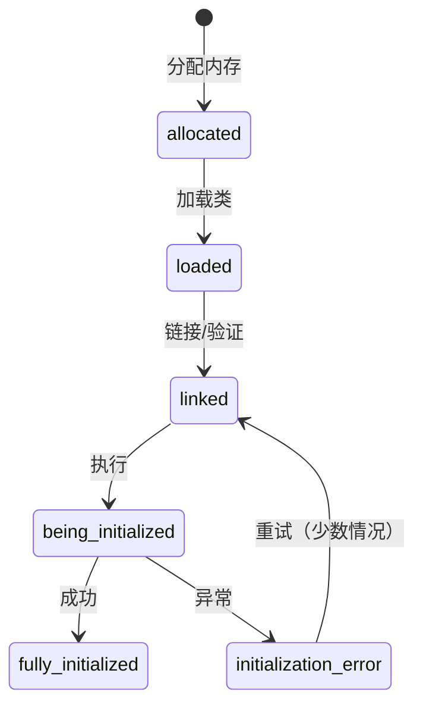

# my_jvm v1.0 源码详细解析

> 基于 OpenJDK 11 源码分析
> 每个文件独立解析，包含完整字段列表、内存布局、设计原理

---

## 目录

1. [oop.hpp - Java 对象头定义](#1-oophpp---java-对象头定义)
2. [markOop.hpp - 对象标记字编码](#2-markoophpp---对象标记字编码)
3. [metadata.hpp - 元数据基类](#3-metadatahpp---元数据基类)
4. [klass.hpp - 类元数据基类](#4-klasshpp---类元数据基类)
5. [instanceKlass.hpp - 实例类元数据](#5-instanceklasshpp---实例类元数据)
6. [method.hpp - 方法元数据](#6-methodhpp---方法元数据)
7. [constMethod.hpp - 方法只读数据](#7-constmethodhpp---方法只读数据)
8. [array.hpp - 元数据数组模板](#8-arrayhpp---元数据数组模板)
9. [globalDefinitions.hpp - 全局类型定义](#9-globaldefinitionshpp---全局类型定义)
10. [debug.hpp - 调试断言宏](#10-debughpp---调试断言宏)
11. [allocation.hpp - 内存分配基类](#11-allocationhpp---内存分配基类)
12. [arena.hpp/cpp - Arena 内存分配器](#12-arenahppcpp---arena-内存分配器)
13. [resourceArea.hpp - 资源区管理](#13-resourceareahpp---资源区管理)
14. [ostream.hpp/cpp - 输出流](#14-ostreamhppcpp---输出流)
15. [growableArray.hpp - 可增长数组](#15-growablearrayhpp---可增长数组)
16. [constantTag.hpp - 常量池标签](#16-constanttaghpp---常量池标签)
17. [atomic.hpp - 原子操作](#17-atomichpp---原子操作)
18. [测试文件](#18-测试文件)

---

## 1. oop.hpp - Java 对象头定义

### 1.1 文件概述

**源码位置**: `src/oops/oop.hpp`  
**对标 OpenJDK**: `hotspot/share/oops/oop.hpp`  
**核心作用**: 定义 Java 对象在 JVM 堆中的内存布局

### 1.2 核心数据结构

#### oopDesc 类

```cpp
class oopDesc {
private:
    volatile markOop _mark;           // 对象标记字
    union _metadata {                 // 元数据指针
        Klass*      _klass;           // 普通指针
        narrowKlass _compressed_klass; // 压缩指针
    } _metadata;
public:
    // ... 方法
};
```

### 1.3 字段详解

| 字段 | 类型 | 偏移 | 大小 | 含义 |
|------|------|------|------|------|
| `_mark` | `volatile markOop` | 0 | 8 | 对象标记字，存储哈希、锁状态、GC 信息 |
| `_metadata._klass` | `Klass*` | 8 | 8 | 指向类元数据的指针 |
| `_metadata._compressed_klass` | `narrowKlass` | 8 | 4 | 压缩的类指针（32位） |

### 1.4 内存布局

```
64-bit 模式（无压缩 oops）:
┌────────────────────────────────────┐
│ offset 0:  _mark (8 bytes)         │ ← 对象标记字
├────────────────────────────────────┤
│ offset 8:  _metadata._klass (8B)   │ ← 类指针
└────────────────────────────────────┘
sizeof(oopDesc) = 16 字节
```

### 1.5 关键设计

#### 为什么 _mark 是 volatile？

```cpp
volatile markOop _mark;
```

**原因**：多线程并发修改 mark word
- 偏向锁：线程 ID 写入
- 轻量级锁：CAS 替换为 Lock Record 指针
- 重量级锁：指向 ObjectMonitor
- GC 标记：并行 GC 修改标记位

#### 为什么用 union 存储类指针？

```cpp
union _metadata {
    Klass*      _klass;            // 64 位直接指针
    narrowKlass _compressed_klass; // 32 位压缩指针
};
```

**原因**：支持 Compressed Class Pointers
- 开启压缩：`-XX:+UseCompressedClassPointers`，节省 4 字节
- 关闭压缩：使用完整 8 字节指针
- union 让两种模式共享同一内存位置

### 1.6 类型判断方法

```cpp
bool is_array() const { 
    return _metadata._klass != nullptr && 
           _metadata._klass->is_array_klass(); 
}

bool is_instance() const { 
    return _metadata._klass != nullptr && 
           _metadata._klass->is_instance_klass(); 
}
```

**设计思想**：通过 Klass 的虚函数判断对象类型，避免在 oopDesc 中存储类型标记。

### 1.7 类型别名

```cpp
typedef oopDesc* oop;            // 普通对象指针
typedef arrayOopDesc* arrayOop;  // 数组对象指针
```

**为什么 oop 是指针而不是类？**
- oop 本质是"指向 Java 堆对象的指针"
- 方便传递：`oop obj` 等同于 `oopDesc* obj`
- 与 OpenJDK 命名一致

---

## 2. markOop.hpp - 对象标记字编码

### 2.1 文件概述

**源码位置**: `src/oops/markOop.hpp`  
**对标 OpenJDK**: `hotspot/share/oops/markOop.hpp`  
**核心作用**: 定义对象标记字的编码格式

### 2.2 核心概念

#### markOop 不是整数！

```cpp
typedef markOopDesc* markOop;  // markOop 是指针类型！
```

**关键理解**：
- `markOop` 是指向 `markOopDesc` 的指针
- 但 `markOopDesc` 没有实例字段，只是把指针值当作整数编码使用
- 通过 `value()` 将 `this` 指针转为 `uintptr_t`

### 2.3 锁状态编码

```cpp
enum {
    locked_value       = 0,    // 轻量级锁（低位 00）
    unlocked_value     = 1,    // 无锁（低位 001）
    monitor_value      = 2,    // 重量级锁（低位 010）
    marked_value       = 3,    // GC 标记（低位 011）
    biased_lock_pattern = 5    // 偏向锁（低位 101）
};
```

### 2.4 mark word 布局（64-bit）

```
┌─────────────────────────────────────────────────────────────────┐
│                    64-bit Mark Word Layout                       │
├─────────────────────────────────────────────────────────────────┤
│                                                                   │
│  无锁状态（unlocked_value = 1）:                                  │
│  ┌──────────────────────────────────┬─────┬───────┬───────────┐ │
│  │ unused:25 │ hashcode:31 │ unused:1 │ age:4 │ biased:1 │ 01 │ │
│  └──────────────────────────────────┴─────┴───────┴───────────┘ │
│                                                                   │
│  偏向锁（biased_lock_pattern = 5）:                               │
│  ┌─────────────────────────────────────┬─────┬───────┬─────────┐│
│  │ JavaThread*:54 │ epoch:2 │ unused:1 │ age:4 │ biased:1 │ 01 ││
│  └─────────────────────────────────────┴─────┴───────┴─────────┘│
│                                                                   │
│  轻量级锁（locked_value = 0）:                                     │
│  ┌───────────────────────────────────────────────────────┬─────┐ │
│  │ LockRecord*:62                                        │ 00 │ │
│  └───────────────────────────────────────────────────────┴─────┘ │
│                                                                   │
│  重量级锁（monitor_value = 2）:                                    │
│  ┌───────────────────────────────────────────────────────┬─────┐ │
│  │ ObjectMonitor*:62                                     │ 10 │ │
│  └───────────────────────────────────────────────────────┴─────┘ │
│                                                                   │
│  GC 标记（marked_value = 3）:                                      │
│  ┌───────────────────────────────────────────────────────┬─────┐ │
│  │ forwarding pointer:62                                 │ 11 │ │
│  └───────────────────────────────────────────────────────┴─────┘ │
└─────────────────────────────────────────────────────────────────┘
```

### 2.5 关键函数实现

#### 锁状态判断

```cpp
bool is_unlocked() const {
    return (value() & 0x7) == unlocked_value;  // 低 3 位 == 001
}

bool is_locked() const {
    return (value() & 0x3) != unlocked_value;  // 低 2 位 != 01
}
```

#### 哈希码提取

```cpp
intptr_t hash() const {
    return (intptr_t)((value() >> 8) & 0x7FFFFFFF);  // hash_shift = 8
}
```

#### 对象年龄

```cpp
uint age() const {
    return (uint)((value() >> 3) & 0xF);  // age_shift = 3, 4 bits
}
```

### 2.6 辅助函数

```cpp
// 创建无锁 mark word
inline markOop markWord_unlocked() {
    return (markOop)(uintptr_t)markOopDesc::unlocked_value;
}

// 创建轻量级锁 mark word
inline markOop markWord_lightweight_locked(void* lock_rec) {
    return (markOop)((uintptr_t)lock_rec);  // 低 2 位天然为 00（对齐）
}

// 创建重量级锁 mark word
inline markOop markWord_heavyweight_locked(void* monitor) {
    return (markOop)((uintptr_t)monitor | 0x2);  // OR 上 monitor_value
}

// 创建偏向锁 mark word
inline markOop markWord_biased(void* thread, int age, int epoch) {
    uintptr_t ptr = (uintptr_t)thread;  // JavaThread* 已 256 字节对齐
    ptr |= ((uintptr_t)epoch << 8) | ((uintptr_t)age << 3) | 0x5;
    return (markOop)ptr;
}
```

### 2.7 设计精妙之处

#### 为什么轻量级锁不需要 OR 标记？

```cpp
inline markOop markWord_lightweight_locked(void* lock_rec) {
    return (markOop)((uintptr_t)lock_rec);  // 直接用，不 OR
}
```

**原因**：Lock Record 在栈上分配，天然 8 字节对齐
- 低 3 位必然是 `000`
- `locked_value = 0`，刚好匹配
- 不需要额外 OR 操作

#### 为什么偏向锁需要特殊编码？

```cpp
inline markOop markWord_biased(void* thread, int age, int epoch) {
    uintptr_t ptr = (uintptr_t)thread;  // 直接用，不左移！
    // ...
}
```

**原因**：JavaThread 也是对齐的（256 字节）
- 低 8 位天然为 `0`
- 可以直接 OR 进 age、epoch、biased 标志
- 节省位宽，让 54 位存线程指针

---

## 3. metadata.hpp - 元数据基类

### 3.1 文件概述

**源码位置**: `src/oops/metadata.hpp`  
**对标 OpenJDK**: `hotspot/share/oops/metadata.hpp`  
**核心作用**: 所有 JVM 元数据的基类

### 3.2 继承体系

```
MetaspaceObj (所有 Metaspace 对象的基类)
    └── Metadata (类相关元数据的基类)
            ├── Klass (类元数据)
            │   ├── InstanceKlass
            │   ├── ObjArrayKlass
            │   └── TypeArrayKlass
            └── Method (方法元数据)
```

### 3.3 MetaspaceObj 类

```cpp
class MetaspaceObj {
public:
    virtual ~MetaspaceObj() {}  // 虚析构函数
    
    // 类型判断（虚函数）
    virtual bool is_klass() const { return false; }
    virtual bool is_method() const { return false; }
    // ...
};
```

**为什么需要虚析构函数？**
- 元数据可能通过基类指针删除
- 确保调用正确的子类析构函数

### 3.4 Metadata 类

```cpp
class Metadata : public MetaspaceObj {
    int _valid;  // 调试用字段，检测是否已删除
    
public:
    Metadata() : _valid(0) {}
    
    bool is_valid() const volatile { return _valid == 0; }
    int identity_hash() { return (int)(uintptr_t)this; }
};
```

### 3.5 内存布局（64-bit slowdebug）

```
┌────────────────────────────────────┐
│ offset 0:  vtable ptr (8 bytes)    │ ← 继承自 MetaspaceObj
├────────────────────────────────────┤
│ offset 8:  _valid (4 bytes)        │ ← NOT_PRODUCT 字段
│ offset 12: padding (4 bytes)       │ ← 对齐到 16 字节
└────────────────────────────────────┘
sizeof(Metadata) = 16 字节
```

**为什么 slowdebug 版本有 _valid？**
- `NOT_PRODUCT(int _valid;)` 仅在非 product 版本存在
- 用于检测 use-after-free 错误
- my_jvm 对标 slowdebug，始终包含此字段

### 3.6 类型判断虚函数

```cpp
virtual bool is_klass() const override { return false; }
virtual bool is_method() const override { return false; }
```

**设计思想**：运行时类型识别（RTTI）的简化版
- 比 `dynamic_cast` 更高效
- 避免 RTTI 开销
- 子类重写对应的虚函数返回 true

---

## 4. klass.hpp - 类元数据基类

### 4.1 文件概述

**源码位置**: `src/oops/klass.hpp`  
**对标 OpenJDK**: `hotspot/share/oops/klass.hpp`  
**核心作用**: 所有类元数据的基类

### 4.2 KlassID 枚举

```cpp
enum KlassID {
    InstanceKlassID,           // 普通实例类
    InstanceRefKlassID,        // java.lang.ref 子类
    InstanceMirrorKlassID,     // java.lang.Class
    InstanceClassLoaderKlassID, // ClassLoader 子类
    TypeArrayKlassID,          // 基本类型数组
    ObjArrayKlassID            // 对象数组
};
```

**用途**：实现 oop closure 的去虚化分发
- 避免 `dynamic_cast` 或多次虚函数调用
- 用于 `switch` 语句快速分派

### 4.3 完整字段列表

```cpp
class Klass : public Metadata {
protected:
    // 高频字段（放在最前面）
    jint        _layout_helper;           // 布局辅助
    const KlassID _id;                    // 类型 ID
    juint       _super_check_offset;      // 快速子类型检查
    
    // 类层次
    Symbol*     _name;                    // 类名
    Klass*      _secondary_super_cache;   // 次级超类缓存
    Array<Klass*>* _secondary_supers;     // 次级超类数组
    Klass*      _primary_supers[8];       // 主超类数组
    
    // Java 镜像
    OopHandle   _java_mirror;             // java.lang.Class
    
    // 类层次关系
    Klass*      _super;                   // 父类
    Klass*      _subklass;                // 第一个子类
    Klass*      _next_sibling;            // 兄弟节点
    Klass*      _next_link;               // 同一 ClassLoader 的链表
    
    // 类加载器
    ClassLoaderData* _class_loader_data;
    
    // 修饰符
    jint        _modifier_flags;
    juint       _access_flags;
    
    // JFR trace
    uint64_t    _jfr_trace_id;
    
    // 偏向锁
    jlong       _last_biased_lock_bulk_revocation_time;
    markOop     _prototype_header;
    jint        _biased_lock_revocation_count;
    
    // vtable
    int         _vtable_len;
    
    // CDS
    jshort      _shared_class_path_index;
    u2          _shared_class_flags;
};
```

### 4.4 关键字段详解

#### _layout_helper

```cpp
jint _layout_helper;
```

**编码规则**：
- 实例类：正数，表示实例大小（字节，已对齐）
- 数组类：负数，编码了 `tag | hsz | ebt | log2(esz)`
- 抽象类/接口：0

**为什么用负数区分数组？**
- 实例大小通常在几百字节以内
- 数组需要编码更多信息（元素类型、每个元素大小）
- 负数自然区分两种用途

#### _primary_supers[8]

```cpp
Klass* _primary_supers[_primary_super_limit];  // limit = 8
```

**设计思想**：
- 大部分类继承深度 < 8
- 线性查找数组比遍历链表快
- 缓存友好（8 个指针 = 64 字节 = 1 缓存行）

#### _super_check_offset

```cpp
juint _super_check_offset;
```

**用途**：快速子类型检查
- 指向 `primary_supers` 或 `secondary_supers`
- 子类型检查只需一次内存访问

### 4.5 内存布局（64-bit slowdebug）

```
┌─────────────────────────────────────────────────────────────┐
│ offset 0-15:   Metadata base (16 bytes)                     │
├─────────────────────────────────────────────────────────────┤
│ offset 16:     _layout_helper (4)                           │
│ offset 20:     _id (4)                                      │
│ offset 24:     _super_check_offset (4) + padding (4)        │
│ offset 32:     _name (8)                                    │
│ offset 40:     _secondary_super_cache (8)                   │
│ offset 48:     _secondary_supers (8)                        │
│ offset 56:     _primary_supers[0-7] (64)                    │
│ offset 120:    _java_mirror (8)                             │
│ offset 128:    _super (8)                                   │
│ offset 136:    _subklass (8)                                │
│ offset 144:    _next_sibling (8)                            │
│ offset 152:    _next_link (8)                               │
│ offset 160:    _class_loader_data (8)                       │
│ offset 168:    _modifier_flags (4)                          │
│ offset 172:    _access_flags (4)                            │
│ offset 176:    _jfr_trace_id (8)                            │
│ offset 184:    _last_biased_lock_bulk_revocation_time (8)   │
│ offset 192:    _prototype_header (8)                        │
│ offset 200:    _biased_lock_revocation_count (4)            │
│ offset 204:    _vtable_len (4)                              │
│ offset 208:    _shared_class_path_index (2) + flags (2)     │
└─────────────────────────────────────────────────────────────┘
sizeof(Klass) = 208 字节（含尾部填充）
```

### 4.6 类型判断虚函数

```cpp
virtual bool is_instance_klass() const { return false; }
virtual bool is_array_klass() const { return false; }
virtual bool is_objArray_klass() const { return false; }
virtual bool is_typeArray_klass() const { return false; }
```

**子类实现**：
- `InstanceKlass::is_instance_klass()` 返回 true
- `ObjArrayKlass::is_objArray_klass()` 返回 true

---

## 5. instanceKlass.hpp - 实例类元数据

### 5.1 文件概述

**源码位置**: `src/oops/instanceKlass.hpp`  
**对标 OpenJDK**: `hotspot/share/oops/instanceKlass.hpp`  
**核心作用**: 普通 Java 类的完整元数据

### 5.2 类初始化状态

```cpp
enum ClassState {
    allocated,              // 已分配（未链接）
    loaded,                 // 已加载并插入类层次
    linked,                 // 已链接/验证
    being_initialized,      // 正在初始化
    fully_initialized,      // 已完全初始化
    initialization_error    // 初始化失败
};
```

**状态转换图**：



### 5.3 OopMapBlock 结构

```cpp
class OopMapBlock {
public:
    int  _offset;   // 起始偏移
    uint _count;    // 连续 oop 字段数量
};
```

**作用**：快速定位对象中的引用字段
- GC 扫描时不需要遍历整个对象
- 压缩存储（8 字节一个块）

**示例**：
```
class Foo {
    int a;        // offset 16, 非 oop
    Object b;     // offset 20, oop
    Object c;     // offset 24, oop
    double d;     // offset 32, 非 oop
};

OopMapBlock: { offset: 20, count: 2 }  // b 和 c 连续
```

### 5.4 完整字段列表

```cpp
class InstanceKlass : public Klass {
protected:
    Annotations*    _annotations;           // 注解
    PackageEntry*   _package_entry;         // 包信息
    Klass* volatile _array_klasses;         // 数组类
    ConstantPool*   _constants;             // 常量池
    
    Array<u2>*      _inner_classes;         // 内部类
    Array<u2>*      _nest_members;          // Nest 成员
    u2              _nest_host_index;       // Nest 宿主索引
    InstanceKlass*  _nest_host;             // Nest 宿主
    
    const char*     _source_debug_extension;
    void*           _array_name;            // 数组名
    
    int             _nonstatic_field_size;  // 非静态字段大小
    int             _static_field_size;     // 静态字段大小
    
    u2              _generic_signature_index;
    u2              _source_file_name_index;
    u2              _static_oop_field_count;
    u2              _java_fields_count;
    
    int             _nonstatic_oop_map_size;
    int             _itable_len;            // 接口表长度
    
    bool            _is_marked_dependent;
    bool            _is_being_redefined;
    u2              _misc_flags;
    
    u2              _minor_version;
    u2              _major_version;
    
    Thread*         _init_thread;           // 初始化线程
    OopMapCache* volatile _oop_map_cache;
    
    void*           _jni_ids;               // JNI id
    void* volatile  _methods_jmethod_ids;   // jmethodID
    
    intptr_t        _dep_context;           // 依赖上下文
    nmethod*        _osr_nmethods_head;     // OSR 方法
    
    void*           _breakpoints;           // 断点
    InstanceKlass*  _previous_versions;     // 历史版本
    
    void*           _cached_class_file;     // 缓存的类文件
    
    volatile u2     _idnum_allocated_count;
    u1              _init_state;            // 初始化状态
    u1              _reference_type;        // 引用类型
    
    u2              _this_class_index;
    void*           _jvmti_cached_class_field_map;
    
    int             _verify_count;
    
    Array<Method*>* _methods;               // 方法数组
    Array<Method*>* _default_methods;       // 默认方法
    Array<Klass*>*  _local_interfaces;      // 本地接口
    Array<Klass*>*  _transitive_interfaces; // 传递接口
    Array<int>*     _method_ordering;       // 方法顺序
    Array<int>*     _default_vtable_indices;
    Array<u2>*      _fields;                // 字段信息
};
```

### 5.5 内存布局（64-bit slowdebug）

```
┌─────────────────────────────────────────────────────────────┐
│ offset 0-207:  Klass base (208 bytes)                       │
├─────────────────────────────────────────────────────────────┤
│ offset 208:    InstanceKlass 字段开始                       │
│ offset 216:    _constants (8)                               │
│ offset 288:    _nonstatic_field_size (4)                    │
│ offset 292:    _static_field_size (4)                       │
│ offset 308:    _itable_len (4)                              │
│ offset 394:    _init_state (1)                              │
│ offset 416:    _methods (8)                                 │
│ ...                                                         │
└─────────────────────────────────────────────────────────────┘
sizeof(InstanceKlass) = 472 字节
```

### 5.6 关键方法

#### 初始化状态判断

```cpp
bool is_loaded() const           { return _init_state >= loaded; }
bool is_linked() const           { return _init_state >= linked; }
bool is_initialized() const      { return _init_state == fully_initialized; }
bool is_being_initialized() const{ return _init_state == being_initialized; }
bool is_in_error_state() const   { return _init_state == initialization_error; }
```

---

## 6. method.hpp - 方法元数据

### 6.1 文件概述

**源码位置**: `src/oops/method.hpp`  
**对标 OpenJDK**: `hotspot/share/oops/method.hpp`  
**核心作用**: Java 方法的元数据

### 6.2 完整字段列表

```cpp
class Method : public Metadata {
private:
    ConstMethod*      _constMethod;          // 只读数据
    MethodData*       _method_data;          // profiling 数据
    MethodCounters*   _method_counters;      // 计数器
    
    u4                _access_flags;         // 访问标志
    int               _vtable_index;         // vtable 索引
    
    u2                _intrinsic_id;         // 内置方法 ID
    mutable u2        _flags;                // 标志位
    u2                _jfr_trace_flag;
    u2                _padding;
    
    int64_t           _compiled_invocation_count;  // 编译调用计数
    
    address           _i2i_entry;            // 解释器入口
    volatile address  _from_compiled_entry;  // 从编译代码调用
    CompiledMethod* volatile _code;          // 编译代码
    volatile address  _from_interpreted_entry;
    CompiledMethod*   _aot_code;             // AOT 代码
};
```

### 6.3 vtable 索引编码

```cpp
enum VtableIndexFlag {
    itable_index_max        = -10,  // itable 索引上限
    pending_itable_index    = -9,   // 待解析
    invalid_vtable_index    = -4,   // 无效
    garbage_vtable_index    = -3,   // 垃圾值
    nonvirtual_vtable_index = -2    // 非虚方法
};
```

**设计思想**：
- 正数：vtable 索引
- `<= -10`：itable 索引（`-(index + itable_index_max)`）
- `-2`：非虚方法，不需要 vtable

### 6.4 内存布局（64-bit slowdebug）

```
┌─────────────────────────────────────────────────────────────┐
│ offset 0-15:   Metadata base (16 bytes)                     │
├─────────────────────────────────────────────────────────────┤
│ offset 16:     _constMethod (8)                             │
│ offset 24:     _method_data (8)                             │
│ offset 32:     _method_counters (8)                         │
│ offset 40:     _access_flags (4)                            │
│ offset 44:     _vtable_index (4)                            │
│ offset 48:     _intrinsic_id (2)                            │
│ offset 50:     _flags (2)                                   │
│ offset 52:     _jfr_trace_flag (2) + padding (2)            │
│ offset 56:     _compiled_invocation_count (8)               │
│ offset 64:     _i2i_entry (8)                               │
│ offset 72:     _from_compiled_entry (8)                     │
│ offset 80:     _code (8)                                    │
│ offset 88:     _from_interpreted_entry (8)                  │
│ offset 96:     _aot_code (8)                                │
└─────────────────────────────────────────────────────────────┘
sizeof(Method) = 104 字节
```

### 6.5 访问标志判断

```cpp
bool is_public() const      { return (_access_flags & 0x0001) != 0; }
bool is_private() const     { return (_access_flags & 0x0002) != 0; }
bool is_protected() const   { return (_access_flags & 0x0004) != 0; }
bool is_static() const      { return (_access_flags & 0x0008) != 0; }
bool is_final() const       { return (_access_flags & 0x0010) != 0; }
bool is_synchronized() const{ return (_access_flags & 0x0020) != 0; }
bool is_native() const      { return (_access_flags & 0x0100) != 0; }
bool is_abstract() const    { return (_access_flags & 0x0400) != 0; }
```

---

## 7. constMethod.hpp - 方法只读数据

### 7.1 文件概述

**源码位置**: `src/oops/constMethod.hpp`  
**对标 OpenJDK**: `hotspot/share/oops/constMethod.hpp`  
**核心作用**: 存储方法的只读数据（字节码、异常表等）

### 7.2 关键设计：字节码内联存储

```cpp
class ConstMethod {
    // ... 字段 ...
    
    // 字节码紧跟在结构体之后！
    u1* code_base() const { return (u1*)(this + 1); }
};
```

**为什么不用指针？**
- 字节码大小通常很小（几十到几百字节）
- 内联存储节省一次内存分配
- 提高缓存局部性

### 7.3 完整字段列表

```cpp
class ConstMethod {
private:
    volatile uint64_t _fingerprint;      // 签名指纹
    ConstantPool*   _constants;          // 常量池
    Array<u1>*      _stackmap_data;      // stackmap
    
    union {
        AdapterHandlerEntry* _adapter;   // 适配器
        AdapterHandlerEntry** _adapter_trampoline;
    };
    
    int             _constMethod_size;   // 总大小（word）
    u2              _flags;              // 标志
    u1              _result_type;        // 返回类型
    
    // 从 offset 48 开始
    u2              _code_size;          // 字节码大小
    u2              _name_index;         // 方法名索引
    u2              _signature_index;    // 签名索引
    u2              _method_idnum;       // 方法 ID
    u2              _max_stack;          // 最大栈深度
    u2              _max_locals;         // 本地变量数
    u2              _size_of_parameters; // 参数大小
    u2              _orig_method_idnum;  // 原始 ID
};
```

### 7.4 内存布局

```
┌─────────────────────────────────────────────────────────────┐
│ offset 0:      vtable ptr (8)                               │
│ offset 8:      _fingerprint (8)                             │
│ offset 16:     _constants (8)                               │
│ offset 24:     _stackmap_data (8)                           │
│ offset 32:     _adapter (8)                                 │
│ offset 40:     _constMethod_size (4)                        │
│ offset 44:     _flags (2) + _result_type (1) + pad (1)      │
│ offset 48:     _code_size (2)                               │
│ offset 50:     _name_index (2)                              │
│ offset 52:     _signature_index (2)                          │
│ offset 54:     _method_idnum (2)                            │
│ offset 56:     _max_stack (2)                               │
│ offset 58:     _max_locals (2)                              │
│ offset 60:     _size_of_parameters (2)                       │
│ offset 62:     _orig_method_idnum (2)                       │
├─────────────────────────────────────────────────────────────┤
│ offset 64+:    字节码（内联存储）                             │
│               exception_table                               │
│               local_variable_table                          │
│               ...                                           │
└─────────────────────────────────────────────────────────────┘
sizeof(ConstMethod) = 56 字节（不含变长数据）
```

### 7.5 字节码访问

```cpp
u1* code_base() const { return (u1*)(this + 1); }
u1* code_end()  const { return code_base() + _code_size; }

void set_code(address code) {
    if (_code_size > 0) {
        memcpy((void*)code_base(), (const void*)code, _code_size);
    }
}
```

---

## 8. array.hpp - 元数据数组模板

### 8.1 文件概述

**源码位置**: `src/oops/array.hpp`  
**对标 OpenJDK**: `hotspot/share/oops/array.hpp`  
**核心作用**: 存储元数据的变长数组

### 8.2 模板定义

```cpp
template <typename T>
class Array : public MetaspaceObj {
private:
    int _length;        // 元素数量
    T   _data[1];       // 变长数组（实际大小由分配决定）
    
public:
    int length() const { return _length; }
    T at(int i) const { return _data[i]; }
    void at_put(int i, T x) { _data[i] = x; }
};
```

### 8.3 内存布局

```
┌────────────────────────────────────┐
│ vtable ptr (8)                     │ ← MetaspaceObj
├────────────────────────────────────┤
│ _length (4) + padding (4)          │
├────────────────────────────────────┤
│ _data[0] (sizeof(T))               │ ← 第一个元素
│ _data[1] (sizeof(T))               │ ← 第二个元素
│ ...                                │
└────────────────────────────────────┘
```

### 8.4 使用示例

```cpp
// 方法数组
Array<Method*>* methods = ...;
Method* m = methods->at(0);

// 接口数组
Array<Klass*>* interfaces = ...;
Klass* k = interfaces->at(0);
```

---

## 9. globalDefinitions.hpp - 全局类型定义

### 9.1 文件概述

**源码位置**: `src/utilities/globalDefinitions.hpp`  
**对标 OpenJDK**: `hotspot/share/utilities/globalDefinitions.hpp`  
**核心作用**: 定义 JVM 使用的基本类型

### 9.2 Java 类型定义

```cpp
typedef bool               jboolean;   // true/false
typedef int8_t             jbyte;      // 8位有符号
typedef int16_t            jshort;     // 16位有符号
typedef int32_t            jint;       // 32位有符号
typedef int64_t            jlong;      // 64位有符号
typedef float              jfloat;     // 32位浮点
typedef double             jdouble;    // 64位浮点
typedef uint16_t           jchar;      // 16位无符号（UTF-16）
```

### 9.3 JVM 内部类型

```cpp
typedef uint8_t            u1;   // 1字节无符号
typedef uint16_t           u2;   // 2字节无符号
typedef uint32_t           u4;   // 4字节无符号
typedef uint64_t           u8;   // 8字节无符号

typedef int8_t             s1;   // 1字节有符号
typedef int16_t            s2;   // 2字节有符号
typedef int32_t            s4;   // 4字节有符号
typedef int64_t            s8;   // 8字节有符号
```

### 9.4 OOP 相关类型

```cpp
class oopDesc;
typedef oopDesc* oop;           // 普通对象指针

class markOopDesc;
typedef markOopDesc* markOop;   // 标记字指针

typedef uint32_t narrowKlass;   // 压缩类指针
```

### 9.5 对齐函数

```cpp
template <typename T, typename A>
inline T align_up(T size, A alignment) {
    return (T)(((size_t)size + alignment - 1) & ~((size_t)alignment - 1));
}

template <typename T, typename A>
inline T align_down(T size, A alignment) {
    return (T)((size_t)size & ~((size_t)alignment - 1));
}

template <typename T, typename A>
inline bool is_aligned(T size, A alignment) {
    return ((size_t)size & ((size_t)alignment - 1)) == 0;
}
```

---

## 10. debug.hpp - 调试断言宏

### 10.1 文件概述

**源码位置**: `src/utilities/debug.hpp`  
**对标 OpenJDK**: `hotspot/share/utilities/debug.hpp`  
**核心作用**: 定义断言和错误报告宏

### 10.2 断言宏

```cpp
// 调试断言（仅 DEBUG 模式生效）
#if ASSERT
#define assert(p, ...) \
    do { if (!(p)) { report_vm_error(...); } } while (0)
#else
#define assert(p, ...)
#endif

// 保证断言（始终生效）
#define guarantee(p, ...) \
    do { if (!(p)) { report_vm_error(...); } } while (0)

// 致命错误
#define fatal(...) \
    do { report_vm_error(__FILE__, __LINE__, "fatal error", __VA_ARGS__); } while (0)

// 不应到达
#define ShouldNotReachHere() \
    do { report_vm_error(__FILE__, __LINE__, "ShouldNotReachHere()"); } while (0)
```

### 10.3 编译期断言

```cpp
template <bool cond> struct STATIC_ASSERT_FAILURE;
template <> struct STATIC_ASSERT_FAILURE<true> { enum { value = 1 }; };

#define STATIC_ASSERT(cond) \
    (void)STATIC_ASSERT_FAILURE<cond>::value
```

---

## 11. allocation.hpp - 内存分配基类

### 11.1 文件概述

**源码位置**: `src/memory/allocation.hpp`  
**对标 OpenJDK**: `hotspot/share/memory/allocation.hpp`  
**核心作用**: 定义内存分配的基类

### 11.2 内存类型标志

```cpp
enum MemoryType {
    mtJavaHeap,      // Java 堆
    mtClass,         // 类元数据
    mtThread,        // 线程对象
    mtCode,          // 生成代码
    mtGC,            // GC 内存
    mtInternal,      // VM 内部
    // ...
};
typedef MemoryType MEMFLAGS;
```

### 11.3 分配基类

#### CHeapObj - C 堆分配

```cpp
template <MEMFLAGS F>
class CHeapObj {
public:
    void* operator new(size_t size) {
        return AllocateHeap(size, F);
    }
    void operator delete(void* p) {
        FreeHeap(p);
    }
};
```

**用途**：生命周期不受作用域限制的对象

#### StackObj - 栈对象

```cpp
class StackObj {
private:
    void* operator new(size_t size);  // 禁止堆分配
    void operator delete(void* p);
};
```

**用途**：RAII 风格的栈上对象

#### ResourceObj - 资源区对象

```cpp
class ResourceObj {
public:
    void* operator new(size_t size);
    void operator delete(void* p);
};
```

**用途**：从 ResourceArea 分配，自动释放

---

## 12. arena.hpp/cpp - Arena 内存分配器

### 12.1 文件概述

**源码位置**: `src/memory/arena.hpp`, `src/memory/arena.cpp`  
**对标 OpenJDK**: `hotspot/share/memory/arena.hpp`  
**核心作用**: 提供快速的区域内存分配

### 12.2 Chunk 类

```cpp
class Chunk : public CHeapObj<mtChunk> {
private:
    Chunk*       _next;     // 链表
    const size_t _len;      // 数据区大小
    
public:
    enum {
        tiny_size   = 256  - slack,
        init_size   = 1024 - slack,
        medium_size = 10 * 1024 - slack,
        size        = 32 * 1024 - slack
    };
};
```

### 12.3 Arena 类

```cpp
class Arena : public CHeapObj<mtNone> {
protected:
    MEMFLAGS _flags;
    Chunk*   _first;        // 第一个 Chunk
    Chunk*   _chunk;        // 当前 Chunk
    char*    _hwm;          // 分配指针
    char*    _max;          // 当前 Chunk 上限
    
public:
    void* Amalloc(size_t x) {
        x = ARENA_ALIGN(x);
        if (_hwm + x > _max) {
            return grow(x);  // 分配新 Chunk
        }
        char* old = _hwm;
        _hwm += x;
        return old;
    }
};
```

### 12.4 分配流程

```
┌─────────────────────────────────────────────────────────────┐
│                      Arena 分配流程                          │
├─────────────────────────────────────────────────────────────┤
│                                                             │
│  Amalloc(size)                                              │
│      │                                                      │
│      ▼                                                      │
│  对齐 size ────────────────────────────────────────┐       │
│      │                                              │       │
│      ▼                                              │       │
│  _hwm + size <= _max ? ────── Yes ──────────────►  │       │
│      │                                              │       │
│      No                                             │       │
│      │                                              │       │
│      ▼                                              │       │
│  grow(size)                                         │       │
│      │                                              │       │
│      ▼                                              │       │
│  分配新 Chunk ─────────────────────────────────────►│       │
│      │                                              │       │
│      │                                              │       │
│      ◄──────────────────────────────────────────────┘       │
│      │                                                      │
│      ▼                                                      │
│  返回 _hwm，_hwm += size                                    │
│                                                             │
└─────────────────────────────────────────────────────────────┘
```

---

## 13. resourceArea.hpp - 资源区管理

### 13.1 文件概述

**源码位置**: `src/memory/resourceArea.hpp`  
**对标 OpenJDK**: `hotspot/share/memory/resourceArea.hpp`  
**核心作用**: 线程本地的资源分配区

### 13.2 ResourceArea 类

```cpp
class ResourceArea : public Arena {
public:
    ResourceArea(MEMFLAGS flags = mtThread) : Arena(flags) {}
    
    char* allocate_bytes(size_t size) {
        return (char*)Amalloc(size);
    }
};
```

### 13.3 ResourceMark 类

```cpp
class ResourceMark : public StackObj {
protected:
    ResourceArea* _area;
    Chunk*        _chunk;      // 保存的 Chunk
    char*         _hwm;        // 保存的高水位
    char*         _max;        // 保存的上限
    
public:
    ResourceMark(ResourceArea* r) 
        : _area(r), _chunk(r->_chunk), 
          _hwm(r->_hwm), _max(r->_max) {}
    
    ~ResourceMark() {
        reset_to_mark();  // 恢复 Arena 状态
    }
};
```

### 13.4 使用模式

```cpp
void foo() {
    ResourceMark rm;  // 构造时保存状态
    
    char* buf = NEW_RESOURCE_ARRAY(char, 1024);  // 从 ResourceArea 分配
    
    // ... 使用 buf ...
    
}  // 析构时自动释放所有分配
```

---

## 14. ostream.hpp/cpp - 输出流

### 14.1 文件概述

**源码位置**: `src/utilities/ostream.hpp`, `src/utilities/ostream.cpp`  
**对标 OpenJDK**: `hotspot/share/utilities/ostream.hpp`  
**核心作用**: 提供统一的输出接口

### 14.2 outputStream 基类

```cpp
class outputStream : public ResourceObj {
protected:
    int  _indentation;  // 缩进
    int  _width;        // 页面宽度
    int  _position;     // 当前行位置
    
public:
    virtual void write(const char* str, size_t len) = 0;
    
    void print(const char* format, ...) ATTRIBUTE_PRINTF(2, 3);
    void print_cr(const char* format, ...) ATTRIBUTE_PRINTF(2, 3);
    
    void cr() { write("\n", 1); _position = 0; }
    void sp(int count = 1);
};
```

### 14.3 派生类

```cpp
// 文件流
class fileStream : public outputStream {
    FILE* _file;
    void write(const char* str, size_t len) override;
};

// 字符串流
class stringStream : public outputStream {
    char*  _buffer;
    size_t _buffer_size;
    size_t _buffer_pos;
};
```

### 14.4 全局输出流

```cpp
extern outputStream* tty;  // 标准输出
```

---

## 15. growableArray.hpp - 可增长数组

### 15.1 文件概述

**源码位置**: `src/utilities/growableArray.hpp`  
**对标 OpenJDK**: `hotspot/share/utilities/growableArray.hpp`  
**核心作用**: 提供动态数组

### 15.2 模板定义

```cpp
template<class E>
class GrowableArray : public GenericGrowableArray {
private:
    E* _data;
    
    void grow(int j);
    
public:
    E& at(int i) { return _data[i]; }
    E& operator[](int i) { return at(i); }
    
    void append(const E& e);
    E pop();
    
    int find(const E& e) const;
    void remove_at(int i);
};
```

### 15.3 分配策略

```cpp
void grow(int j) {
    int new_max = _max;
    if (new_max == 0) new_max = 2;
    while (new_max <= j) new_max = new_max * 2;  // 2 倍扩容
    // ...
}
```

---

## 16. constantTag.hpp - 常量池标签

### 16.1 文件概述

**源码位置**: `src/utilities/constantTag.hpp`  
**对标 OpenJDK**: `hotspot/share/utilities/constantTag.hpp`  
**核心作用**: 定义常量池条目的类型标签

### 16.2 标签枚举

```cpp
enum {
    JVM_CONSTANT_Utf8               = 1,
    JVM_CONSTANT_Integer            = 3,
    JVM_CONSTANT_Float              = 4,
    JVM_CONSTANT_Long               = 5,
    JVM_CONSTANT_Double             = 6,
    JVM_CONSTANT_Class              = 7,
    JVM_CONSTANT_String             = 8,
    JVM_CONSTANT_Fieldref           = 9,
    JVM_CONSTANT_Methodref          = 10,
    JVM_CONSTANT_InterfaceMethodref = 11,
    JVM_CONSTANT_NameAndType        = 12,
    JVM_CONSTANT_MethodHandle       = 15,
    JVM_CONSTANT_MethodType         = 16,
    JVM_CONSTANT_Dynamic            = 17,
    JVM_CONSTANT_InvokeDynamic      = 18,
};
```

### 16.3 constantTag 类

```cpp
class constantTag {
private:
    jbyte _tag;
    
public:
    bool is_klass() const   { return _tag == JVM_CONSTANT_Class; }
    bool is_field() const   { return _tag == JVM_CONSTANT_Fieldref; }
    bool is_method() const  { return _tag == JVM_CONSTANT_Methodref; }
    // ...
};
```

---

## 17. atomic.hpp - 原子操作

### 17.1 文件概述

**源码位置**: `src/runtime/atomic.hpp`  
**对标 OpenJDK**: `hotspot/share/runtime/atomic.hpp`  
**核心作用**: 提供原子操作封装

### 17.2 原子操作

```cpp
// 原子加载
inline jint atomic_load(const jint* addr) {
    return __atomic_load_n(addr, __ATOMIC_SEQ_CST);
}

// 原子存储
inline void atomic_store(jint* addr, jint val) {
    __atomic_store_n(addr, val, __ATOMIC_SEQ_CST);
}

// CAS
inline jint atomic_cas(jint* addr, jint exchange_val, jint compare_val) {
    __atomic_compare_exchange_n(addr, &compare_val, &exchange_val, 
                                false, __ATOMIC_SEQ_CST, __ATOMIC_SEQ_CST);
    return compare_val;
}

// 原子加法
inline jint atomic_add(jint* addr, jint val) {
    return __atomic_fetch_add(addr, val, __ATOMIC_SEQ_CST);
}
```

### 17.3 使用 GCC 内置原子操作

```cpp
__atomic_load_n(ptr, memory_order)
__atomic_store_n(ptr, val, memory_order)
__atomic_compare_exchange_n(ptr, expected, desired, weak, success_order, failure_order)
__atomic_fetch_add(ptr, val, memory_order)
```

---

## 18. 测试文件

### 18.1 test_types.cpp

**测试内容**：
- 基本类型定义
- 指针类型
- oopDesc 创建和锁状态
- markOop 编码
- Klass 和 Method 创建
- 原子操作
- 对齐宏

### 18.2 verify_layout.cpp

**验证内容**：
- sizeof 各数据结构
- 字段偏移量
- 与 OpenJDK 11 slowdebug 对比

**输出示例**：

```
[oopDesc]
  sizeof(oopDesc) = 16
  offsetof(_mark) = 0
  offsetof(_metadata) = 8

[Klass]
  sizeof(Klass) = 208
  offsetof(_layout_helper) = 12
  offsetof(_super) = 120

[Method]
  sizeof(Method) = 104
  offsetof(_constMethod) = 16
  offsetof(_access_flags) = 40
```

---

## 总结

### 数据结构层面

| 结构 | 大小 | 核心作用 |
|------|------|----------|
| oopDesc | 16B | Java 对象头 |
| markOop | 8B (指针) | 对象标记字编码 |
| Metadata | 16B | 元数据基类 |
| Klass | 208B | 类元数据基类 |
| InstanceKlass | 472B | 实例类元数据 |
| Method | 104B | 方法元数据 |
| ConstMethod | 56B | 方法只读数据 |

### 设计亮点

1. **markOop 编码**：用指针值编码多种状态，节省内存
2. **字节码内联**：ConstMethod 字节码紧跟结构体，提高缓存局部性
3. **Arena 分配**：批量分配、批量释放，避免频繁 malloc/free
4. **ResourceMark**：RAII 风格自动内存管理
5. **压缩指针**：union 设计支持 32/64 位无缝切换
